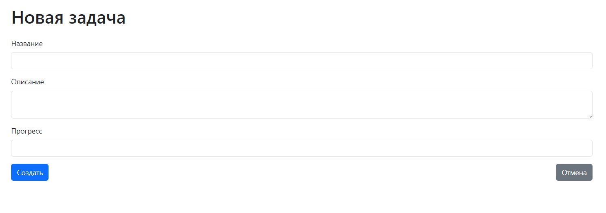
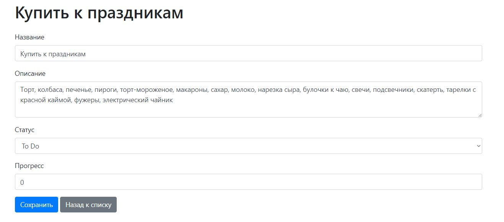

# TrackerFlask
## Описание проекта
Проект **TaskTracker** представляет собой приложение для управления задачами, реализованное с использованием трех популярных фреймворков Python: Django, FastAPI и Flask. Основная цель проекта — сравнение производительности, удобства использования и возможности каждого из этих фреймворков для разработки веб-приложений.
В проекте реализована базовая функциональность для отображения, создания, редактирования и удаления задач. Он демонстрирует особенности каждого фреймворка, включая работу с базой данных, аутентификацию пользователей и обработку запросов.

### Маршруты и обработка запросов

В проекте используется Flask для создания API и обработки запросов. Логика маршрутов реализована в файле `routes.py`. Каждый маршрут определяет точку входа для конкретного запроса (например, GET, POST, PUT, DELETE).

Для работы с базой используется SQLAlchemy.

**Основные маршруты приложения**
-	GET / — отображает список всех задач с их статусом, прогрессом и действиями.
-	GET /task/new и POST /task/new — форма и обработка создания новой задачи.
-	GET /task/<task_id>/edit и POST /task/<task_id>/edit — редактирование существующей задачи.
-	POST /task/<task_id>/complete — завершение задачи (установка статуса “done” и прогресса на 100%).
-	POST /task/<task_id>/delete — удаление задачи.

Для отображения данных используется `Jinja2` и следующие шаблоны:

`index.html` — таблица задач с возможностью редактирования _(щелчок по названию или описанию задачи)_, удаления и завершения задач.

`create_task.html` — форма для создания новой задачи.

`edit_task.html` — форма для редактирования существующей задачи.

 
Статические ресурсы (CSS) могут быть подключены для стилизации интерфейса (в подпапке /static), включая использование Bootstrap. На данном этапе для упрощения использован вложенный в html блок стилизации

### Особенности работы с базой данных
`SQLAlchemy` используется для работы с базой данных `SQLite`. В файле` extensions.py` создаётся объект db, который инициализируется в `app.py`. Для упрощения разработки миграции базы данных не реализованы, однако структура таблиц создаётся автоматически при запуске приложения.

### Основные компоненты реализации
1.	Фабрика приложения В` app.py` реализована функция `create_app`, которая создаёт экземпляр приложения, настраивает подключение к базе данных и регистрирует `Blueprint` для маршрутов.
2.	Обработка форм В` routes.py` реализована обработка форм для создания и редактирования задач. Данные передаются через HTTP-запросы и сохраняются в базе данных.
3.	Модели данных В модели Task добавлено поле progress, позволяющее отслеживать прогресс выполнения задачи, и статус, который отражает её текущее состояние.

===========================================
## Установка проекта Flask
Для запуска проекта следуйте этим шагам:
1.	Клонируйте репозиторий:

`git clone https://github.com/Vivisector/TrackerFlask.git`
2.	Перейдите в папку с проектом:

`cd Diplom_Flask`
3.	Создайте виртуальное окружение (если не использовалось ранее):

`python -m venv venv`

`venv\Scripts\activate`
4.	Установите зависимости:

`pip install -r requirements.txt`
## Использование проекта
Для запуска проекта выполните команду:

`flask run`

Приложение будет доступно по адресу http://127.0.0.1:5000/.

## Основной функционал проекта

•	Реализован легковесный RESTful API для работы с задачами.

•	Простая и понятная реализация с использованием Flask.

•	Подключение к базе данных через SQLAlchemy

### Автор проекта
*Беляков Дмитрий*

